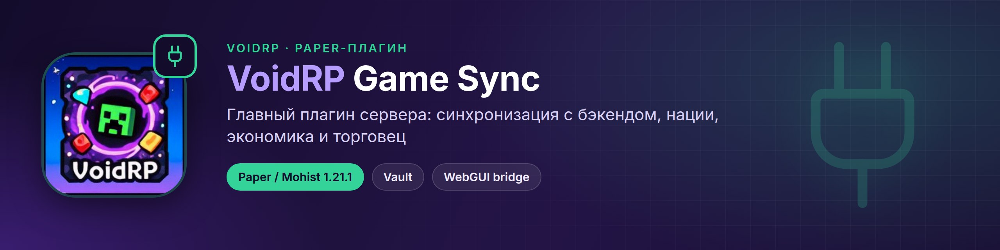
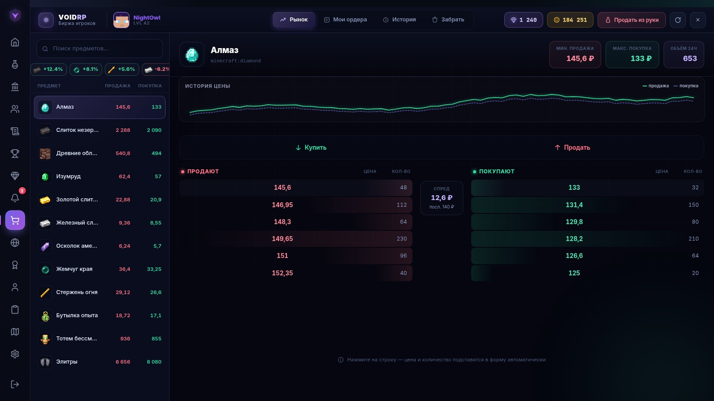
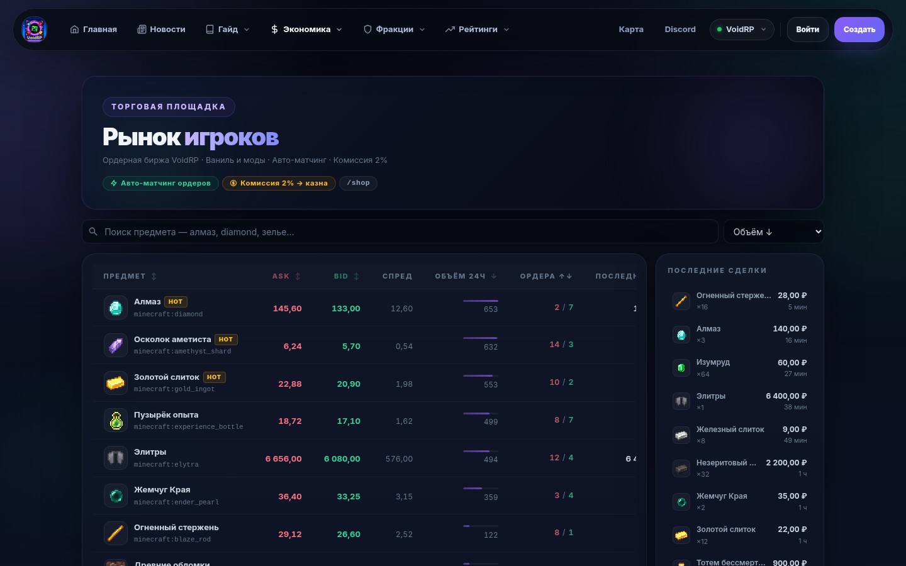
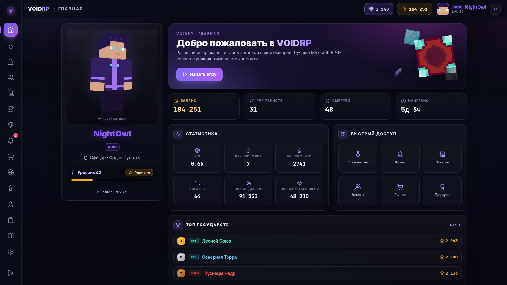
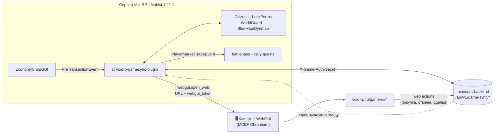
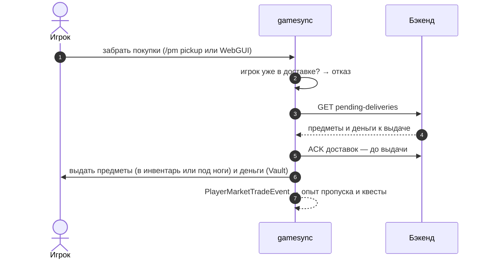
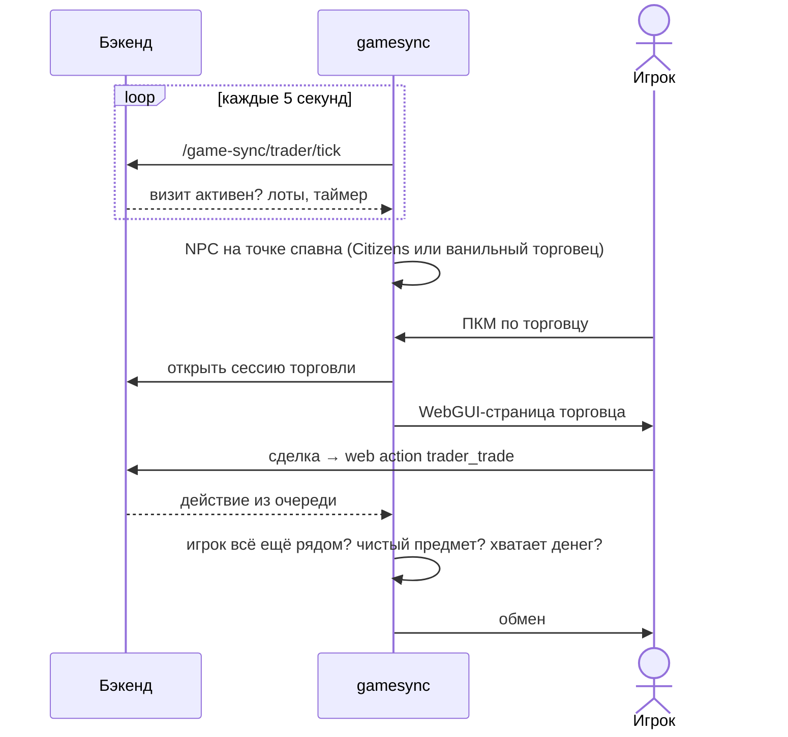

<p align="center"></p>

<div align="center">


[](https://github.com/VOIDRP-MINECRAFT/voidrp-gamesync-plugin/actions/workflows/build.yml)


</div>

> Главный Paper-плагин сервера VoidRP: синхронизация с бэкендом, нации и альянсы, экономика с модовыми
> предметами, рынок игроков, странствующий торговец, гайд новичка и мост к WebGUI-страницам в игре.

---

## 📸 Как это выглядит

<table>
<tr>
<td width="50%"><br><sub>Биржа в игре: стакан ордеров, история цены</sub></td>
<td width="50%"><br><sub>Тот же рынок на сайте</sub></td>
</tr>
<tr>
<td width="50%"><br><sub>Меню игрока: данные, которые плагин синхронизирует</sub></td>
</tr>
</table>

<sub>Страницы [voidrp-site](https://github.com/VOIDRP-MINECRAFT/voidrp-site) на демо-данных; плагин отдаёт им статистику, рынок и доставку предметов.</sub>

---

## 🗺️ Место в экосистеме



---

## ✨ Возможности

| Область | Что делает |
|---|---|
| 🏛️ **Нации** | Синхронизация состава и статистики, LuckPerms-мета `nation`/`nation_role` с префиксами, маркеры на карте и цвета регионов WorldGuard, подсчёт территории (FTB Chunks или WorldGuard), столица (`/nsetcapital`), подсказки лидеру в HUD, если столица не на месте |
| 💰 **Казна и исследования** | Взносы и вывод (`/ndonate`, `/nwithdraw`), история, дерево исследований нации (`/nres`) с эффектами: бонусы опыта пропуска, слоты квестов и т. д. |
| 🤝 **Альянсы** | Предложения и голосования (`/ally`), отключение урона по союзникам |
| 💹 **Экономика** | Прокси-шоп модовых предметов для EconomyShopGUI, динамические цены из бэкенда, синхронизация отображаемых цен, `/price` |
| 🛒 **Рынок игроков** | Ордера на покупку и продажу (`/shop`, `/pm`), рынок наций (`/nmarket`), безопасная доставка, WebGUI-страницы |
| 🧳 **Странствующий торговец** | NPC на спавне по расписанию бэкенда, сделки только рядом с ним, голограмма с таймером |
| 🧭 **Новичкам** | Гайд при первом входе (`/гайд`), дорожная карта прогресса (`/путь`), контекстные подсказки в HUD, эпохи прогресса по ключевым предметам, стартовый набор |
| 🎁 **Награды** | Достижения, еженедельные испытания (3 в неделю), рефералы, TikTok-кампании, Void Coins |
| 🎨 **Косметика и скины** | Меню косметики (`/cosmetics`), выдача админом, применение скинов с сайта |
| 🛡️ **Правила и согласия** | Скрытие игроков на BlueMap без согласия на распространение ПДн (152-ФЗ), напоминание о непринятых документах, удаление запрещённых предметов |
| 🖥️ **WebGUI-мост** | Открытие страниц сайта поверх игры, HUD, меню по <kbd>F6</kbd>, приём действий со страниц |

---

## 🛒 Рынок игроков: доставка без дюпов



Подтверждение уходит на бэкенд **до** выдачи: если игрок отключится посреди доставки, повторной выдачи не будет.
Комиссия — 2% (1% с Premium), отмена ордера — 0,5%.

## 🧳 Странствующий торговец



---

## 🌐 WebGUI Bridge

Плагин — **единственный транспорт** для отправки WebGUI-пакетов клиентам. Bukkit не может диспатчить NeoForge-команды, поэтому пакеты уходят через `player.sendPluginMessage()`.

### WebGuiBridgeService API

```java
// Открыть fullscreen GUI
webGuiBridge.openGui(player, "https://void-rp.ru/game-ui#market");

// Открыть HUD-оверлей
webGuiBridge.openHud(player, "https://void-rp.ru/game-ui/hud");

// Задать URL для клавиши F6 (главное меню)
webGuiBridge.sendMainMenuUrl(player, "https://void-rp.ru/game-ui/menu");

// Удобные методы
webGuiBridge.openMarket(player);        // /pm, /market, /shop
webGuiBridge.openNationMarket(player);  // /nmarket
webGuiBridge.openTreasury(player);      // /ntreasury
webGuiBridge.openBattlepass(player);    // /bp (кнопка в меню)
webGuiBridge.openQuests(player);        // /quests (кнопка в меню)
```

`signUrl(url)` — автоматически добавляет `?webgui_token=<HMAC-SHA256>` к URL перед отправкой. Секрет читается из `config/webgui/server.json` (тот же файл что и NeoForge мод).

### Протокол пакетов

```text
Канал: webgui:open_web
Payload: VarInt(protocolVersion=1) + VarInt(mode: 0=GUI / 1=HUD) + MCString(url_with_token)

Канал: webgui:set_main_menu
Payload: MCString(url)
```

Регистрация каналов в `registerOutgoingPluginChannel` обёрнута в try-catch — NeoForge мод может зарегистрировать их первым (P1.10).

### WebActionPollService

Поллит `GET /game-sync/market-web-actions` каждую секунду. Обрабатывает действия, созданные браузерной страницей:

| action_type | Что делает |
|---|---|
| `buy` | Списывает деньги через Vault, создаёт buy order |
| `cancel_sell` | Возвращает предмет, удерживает комиссию 0.5% |
| `cancel_buy` | Возвращает деньги (за вычетом комиссии) |
| `pickup` | Выдаёт pending доставки (ack before deliver) |

`inFlight`-защита (ConcurrentHashMap) предотвращает двойную обработку при медленном backend.

### WebGuiPlayerJoinListener

При входе игрока (60-tick delay = 3 сек) отправляет `sendMainMenuUrl` с URL из `config.yml` → `webgui.urls.menu`. Delay нужен чтобы NeoForge мод успел проинициализироваться на клиенте.

---

## 📋 Требования

| Компонент | Версия |
|---|---|
| Paper / Mohist | 1.21.1 |
| Java | 21 |
| Vault | обязательно |
| Citizens, LuckPerms, WorldGuard, Dynmap/BlueMap, SkinsRestorer, EconomyShopGUI | опционально |

---

## 🚀 Сборка и деплой

```bash
./gradlew shadowJar
# → build/libs/voidrp-game-sync-paper-1.4.0-all.jar

# Горячая перезагрузка без рестарта сервера
cp build/libs/voidrp-game-sync-paper-*-all.jar /path/to/server/plugins/VoidRpGameSync.jar
mcrcon -H 127.0.0.1 -P 25575 -p <pass> "plugman reload VoidRpGameSync"
```

> [!IMPORTANT]
> После деплоя удалите старый jar из `plugins/`, иначе Paper увидит `Ambiguous plugin name` и загрузит не тот файл.

---

## ⚙️ Конфигурация

`plugins/VoidRpGameSync/config.yml` (главное):

```yaml
backend:
  base-url: "https://api.void-rp.ru"
  api-prefix: "/api/v1"
  game-auth-secret: ""        # X-Game-Auth-Secret этого сервера — только на сервере, не в git
sync:
  period-seconds: 180
territory:
  source: ftbchunks           # или worldguard
economy-market:
  enabled: true
starter-kit:
  enabled: false
epochs:
  enabled: true
webgui:
  enabled: false
  urls:
    menu: "https://void-rp.ru/game-ui/menu"
    market: "https://void-rp.ru/game-ui/market"
    battlepass: "https://void-rp.ru/game-ui/battlepass"
    hud: "https://void-rp.ru/game-ui/hud"
banned-items:
  ids: ["reliquary:rod_of_lyssa", "relics:infinity_ham"]
```

**`plugins/VoidRpGameSync/modded_items.yml`** — реестр модовых предметов:
```yaml
"Section.pageN.items.M":
  id: "namespace:item_id"
  display: "Название"
  buy: 10000000.0
  sell: 2500000.0
  locked: false           # true = фиксированная цена, игнорировать DB
```

---

## ⌨️ Команды

### Игрокам

| Команда | Что делает |
|---|---|
| `/guide` (`/гайд`, `/новичок`) | Гайд новичка |
| `/roadmap` (`/путь`, `/progress`) | Дорожная карта прогресса |
| `/shop` (`/market`), `/pm` | Рынок игроков |
| `/nmarket` (`/nm`) | Рынок наций |
| `/price` (`/mprice`) | Текущая рыночная цена предмета |
| `/ndonate`, `/ntreasury`, `/ntreasuryhistory`, `/nwithdraw` | Казна нации |
| `/nres` | Исследования нации |
| `/nsetcapital` | Поставить столицу нации |
| `/ally` | Альянсы |
| `/cosmetics` (`/косметика`) | Меню косметики |

### Администраторам (`voidrp.gamesync.admin`)

| Команда | Что делает |
|---|---|
| `/vrgs reload` | Перечитать конфиг |
| `/vrgs sync all \| nation <slug> \| player <ник>` | Синхронизация |
| `/vrgs market status \| reload \| recalculate \| visual-sync \| price` | Рыночные цены |
| `/vrgs trader here` | Поставить точку торговца |
| `/vrgs voidcoin <игрок> <кол-во>` | Выдать или списать Void Coins |
| `/vrgs cosmetic grant \| list` | Косметика |
| `/vrgs skin refresh \| clear <игрок>` | Скины |
| `/vrgs reward resolve \| apply <игрок>` | Реферальные награды |
| `/vrgs territory debug <slug>` | Отладка территории нации |
| `/vrgs tiktok <ссылка>` | TikTok-кампания |

---

## 🔗 Связанные репозитории

| Репо | Связь |
|---|---|
| [minecraft-backend](https://github.com/VOIDRP-MINECRAFT/minecraft-backend) | Все данные: `/api/v1/game-sync/*` |
| [voidrp-webgui-neoforge](https://github.com/VOIDRP-MINECRAFT/voidrp-webgui-neoforge) | Мод, который принимает наши пакеты и рисует страницы |
| [voidrp-site](https://github.com/VOIDRP-MINECRAFT/voidrp-site) | Страницы `/game-ui/*` |
| [voidrp-battlepass](https://github.com/VOIDRP-MINECRAFT/voidrp-battlepass) · [voidrp-daily-quests](https://github.com/VOIDRP-MINECRAFT/voidrp-daily-quests) | Слушают `PlayerMarketTradeEvent`, используют исследования наций |

Как сервисы общаются между собой — в [документации организации](https://github.com/VOIDRP-MINECRAFT/.github/blob/main/docs/INTEGRATION.md).

---

<div align="center">
<a href="https://void-rp.ru">🌐 Сайт</a> ·
<a href="https://github.com/VOIDRP-MINECRAFT">🏠 Организация</a> ·
<a href="https://github.com/VOIDRP-MINECRAFT/.github/blob/main/docs/WEBGUI_ARCHITECTURE.md">📐 WebGUI Architecture</a>
</div>
